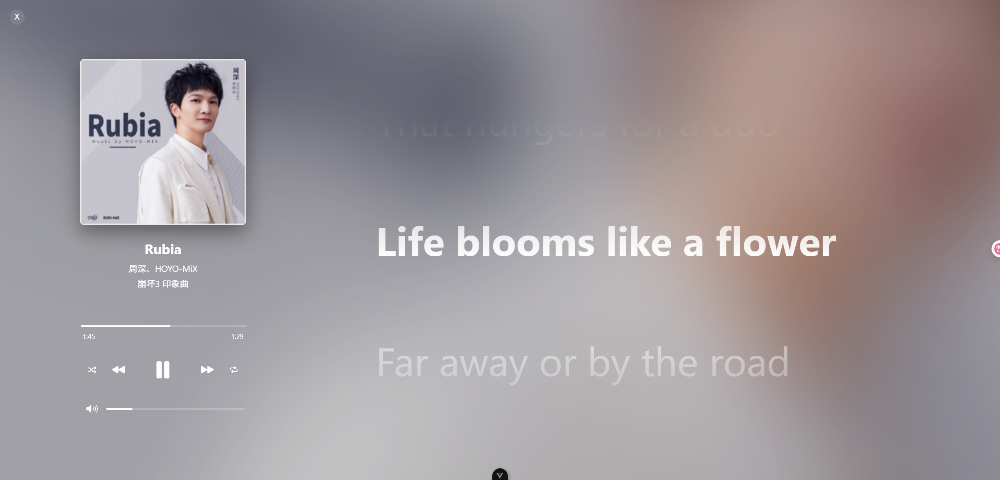

# 一个使用ai编写的vite 音乐播放器前端



## 项目介绍

本项目是一个旨在模仿 Apple Music 用户界面的 Web 音乐播放器。我们不仅追求视觉上的相似，更尝试使用 AI 技术来逐步还原其细节，甚至模仿 Apple Music 的部分交互逻辑和动画效果。

当前版本已经实现了基础的音乐播放功能和歌词同步显示，并着重优化了用户与歌词的交互体验。

## 现有功能

* **基础播放控制：** 播放、暂停、上一曲、下一曲、音量调节。
* **进度条控制：** 拖动或点击进度条跳转播放时间。
* **歌词同步显示：** 实时高亮当前播放的歌词。
* **歌词点击跳转：** 点击歌词可以跳转到歌曲的对应时间。
* **歌词滑动暂停：** 用户滑动歌词时，自动滚动会暂停，停止滑动后恢复。
* **播放列表管理 (基础)：** 可以通过控制台添加和移除歌曲。
* **本地存储播放列表：** 用户的播放列表会保存在本地浏览器中。
* **跨标签页/窗口同步播放列表：** 使用 Broadcast Channel 实现播放列表在不同标签页/窗口间的同步更新。
* **模糊背景效果：** 播放器背景会根据当前歌曲的封面进行模糊处理。

## 未来功能 (尽情期待！)

* **AI 驱动的歌曲推荐：** 基于用户历史播放、喜好等数据，智能推荐可能喜欢的音乐。
* **更智能的歌词体验：** 歌词翻译、歌曲情感分析、卡拉 OK 模式等。
* **更丰富的播放列表管理：** 创建、编辑、分享播放列表。
* **专辑和艺术家信息展示：** 展示更全面的音乐元数据。
* **无缝跨设备播放体验：** 记录用户播放状态，在不同设备间同步。
* **更精致的 UI 动画和过渡效果：** 进一步模仿 Apple Music 的视觉风格。
* **支持更多音频格式。**
* **更强大的搜索功能。**
* **用户账户系统。**

## 技术栈

* **前端框架:** Vue.js (Composition API)
* **状态管理:** Vue 的响应式系统 (ref, computed, watch)
* **歌词解析:** 自定义 JavaScript 解析器
* **本地存储:** Local Storage
* **跨标签页通信:** Broadcast Channel
* **构建工具:** Vite

## 如何使用

### 编译运行

1.  **克隆项目到本地：**
    ```bash
    git clone https://github.com/Qi-2007/music-player.git
    cd music-player
    ```

2.  **安装依赖：**
    ```bash
    npm install # 或 yarn install
    ```

3.  **编译并运行开发服务器：**
    ```bash
    npm run dev # 或 yarn dev
    ```

4.  **在浏览器中打开：**
    访问控制台输出的开发服务器地址 (通常是 `http://localhost:3000`).

### 在浏览器控制台添加歌单测试

为了方便在开发阶段进行测试，您可以在浏览器的控制台中手动添加一些歌曲到播放列表。请按照以下步骤操作：

1.  **打开您的音乐播放器页面。**
2.  **打开浏览器的开发者工具 (通常按下 F12 键)。**
3.  **切换到 "Console" (控制台) 选项卡。**
4.  **粘贴并执行以下 JavaScript 代码，以添加一些示例歌曲到 `localStorage`:**

    ```javascript
    const initialPlaylist = [
      {
        id: '1',
        title: 'Example Song 1',
        artist: 'Unknown Artist',
        audioUrl: 'your_audio_url_1.mp3', // 替换为您的音频文件 URL
        coverUrl: 'your_cover_url_1.jpg', // 替换为您的封面图片 URL
        lrcString: `[00:00.00]Example Song 1\n[00:05.00]This is the first line.\n[00:10.00]And here's the second line.` // 替换为您的歌词
      },
      {
        id: '2',
        title: 'Another Great Song',
        artist: 'Some Artist',
        audioUrl: 'your_audio_url_2.mp3', // 替换为您的音频文件 URL
        coverUrl: 'your_cover_url_2.jpg', // 替换为您的封面图片 URL
        lrcString: `[00:00.00]Another Great Song\n[00:02.50]The song begins now.\n[00:07.00]Enjoy the music!` // 替换为您的歌词
      }
    ];

    localStorage.setItem('music-player-playlist', JSON.stringify(initialPlaylist));
    console.log('测试歌单已添加到 localStorage。请刷新页面查看。');

    // 如果您的项目使用 BroadcastChannel，您可能还需要通知其他标签页：
    const playlistChannel = new BroadcastChannel('music-player-playlist-updates');
    playlistChannel.postMessage({ type: 'playlistUpdated' });
    playlistChannel.close();
    ```

    **请务必将 `your_audio_url_*.mp3` 和 `your_cover_url_*.jpg` 替换为实际可用的音频和封面图片 URL，并将 `lrcString` 替换为实际的歌词内容。**

5.  **刷新您的音乐播放器页面。** 播放器应该会加载您在控制台中添加的测试歌曲。

## 🔗 我的其他项目

您可能也会对我的其他项目感兴趣：

* [music-downloader](https://github.com/Qi-2007/music-downloader): 一个 AI 驱动的音乐下载器前端。

---

感谢您的关注！如果您有任何建议或发现了 Bug，欢迎提交 Issue 或 Pull Request。